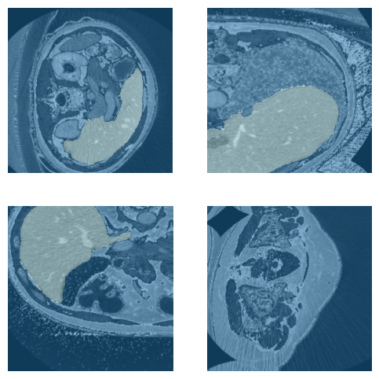
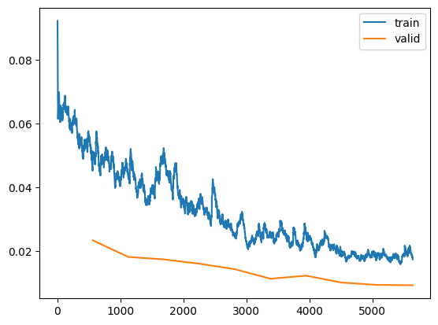
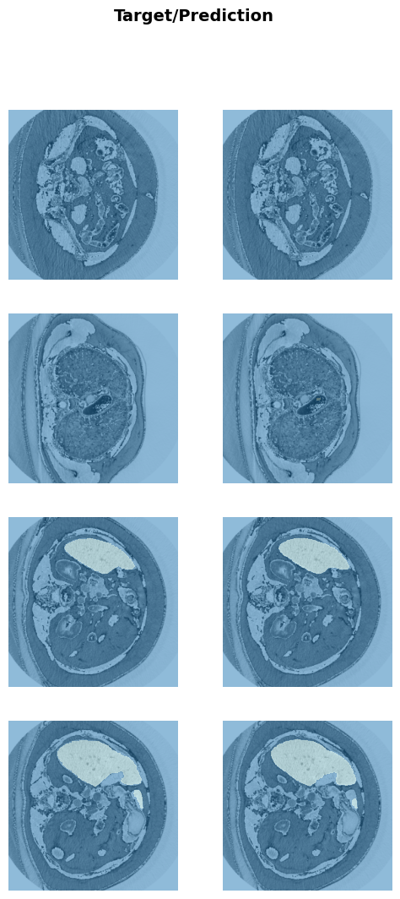

# Liver segmentation with unet+resnet
<p>Performs liver segmentation with neural networks, specificly, with UNet and a pre-trained resnet encoder. 
<p>liver images were described in this <a href='https://arxiv.org/pdf/1702.05970.pdf'>research paper</a>.</p>

## Datasets
The raw data in nifti format(nii.gz) are from <a href='https://www.dropbox.com/s/8h2avwtk8cfzl49/ircad-dataset.zip?dl=0'>here</a>, and are put under the folders: `data/{train,test}/nii/`.

The program first converts nifti images into 2D png images (each slice of the 3D image corresponds to a png image), in order to incorporate data augmentation easily.

### Training, validation, and testing datasets
There are 20 subjects in total. Eighteen of them will be used for training and validation,resulting in 1980 images for training and 494 images for validation.
Two subjects (349 images) will be used for independent testing.
An example batch from the training dataset: 
<p align="center"></img></p>


## Model and trainning
<p>The neural network is build on the fastai platform with unet_learner. The encoder of the unet is a pretrained resnet34 neural network. Context information of a  layer of the encoder is used in the corresponding layer of the decoder through hook mechanism. </p>
<p>Loss function: CrossEntropyLossFlat</p>
<p align="center"></img></p>
 
## Results
### Performance metric
<a href='https://en.wikipedia.org/wiki/S%C3%B8rensen%E2%80%93Dice_coefficient'>Dice coefficient</a> was used for evaluation. 
### Dice on validation dataset
dice coefficient: 97.2%, averaged across 494 images. 
<p align="center"></img></p>

### Dice on independent testing dataset
dice coefficient: 95.2%, averaged across 349 images. 
<p align="center"></img></p>

## How to run
- create env unet 
```
conda env create -f unet-env.yml
```
- jupyter notebook
<p>open the unet-kl notebook and run step-by-step.</p>

## TODOs: 
1. Testing time augmentation.
2. Imbalance of liver/non-liver tissues.

## Acknowledgments
* <a href='https://pypi.org/project/fastai/'> fastai package </a> 
* Datasets from <a href='https://github.com/soribadiaby/Deep-Learning-liver-segmentation'> Deep-Learning-liver-segmentation </a>
