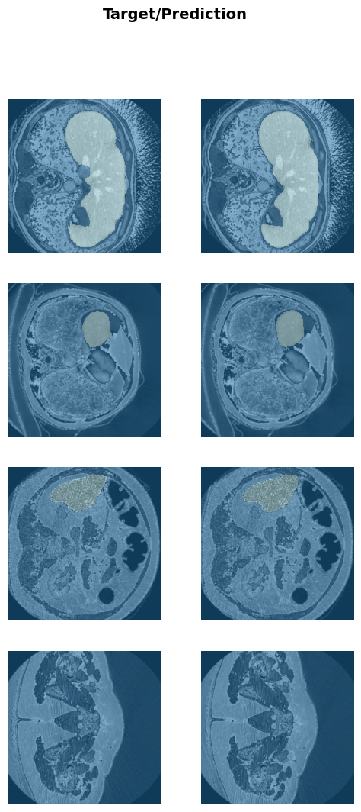

# liver segmentation with unet+resnet

performs liver segmetnation with neural networks, specificly, with UNet and pre-trained encoder resnet. 

liver images as described in this <a href='https://arxiv.org/pdf/1702.05970.pdf'>research paper</a>.

## Datasets
The raw data is in nifti format, and is available <a href='https://www.dropbox.com/s/8h2avwtk8cfzl49/ircad-dataset.zip?dl=0'>here</a>. 
Will conver 3D nifti images to 2D png images (each slice corresponds to one png image), in order to use  existing augmentation solution.

### Training, validation, and testing datasets
There are 20 subjects in total, 18 will be used for training and validation (2474 slices/images, train:valid=4:1), two will be used for independent testing (349 slices/images).

</img>

## Model and trainning

The neural network was build on the fastai platform. The encoder of the Unet was a resnet34 neural network. Parameters were pre-trained.

Loss function: CrossEntropyLossFlat

</img>

 

## Segmentation performance measure
<a href='https://en.wikipedia.org/wiki/S%C3%B8rensen%E2%80%93Dice_coefficient'>Dice coefficient</a> was used for evaluation. 

## Results
Validation dataset, dice coefficient: 97.1%; 

</img>

Independent testing dataset: dice coefficient: 95.2%; 

</img>

## Acknowledgments

* <a href='https://github.com/jocicmarko/ultrasound-nerve-segmentation'>Ultrasound nerve segmentation</a>
* <a href='https://www.ircad.fr/fr/'>Institut de recherche contre les cancers de l'appareil digestif</a>
